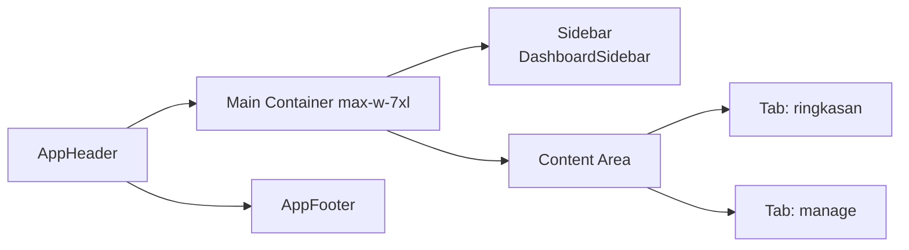

# Plan – Rapikan Halaman Dashboard ala `a.html` (Scope Revisi)

Project: Event Management System (Nuxt 3 + Vue 3 + TS + Clean Architecture + Supabase)
Referensi UI: `a.html` (Panel Admin/Panitia)
File target utama: [`pages/dashboard.vue`](pages/dashboard.vue:1)

> **Status scope (2026-06-14):** disetujui user — tab **Scanner Absensi QR** & **Data Reservasi & Absen** di-skip dulu. Sidebar cukup memuat 2 entri (Ringkasan + Kelola Event). Tab lain bisa ditambahkan nanti tanpa mengubah kontrak `DashboardSidebar.vue`.

---

## 1. Tujuan

Membuat [`pages/dashboard.vue`](pages/dashboard.vue:1) terlihat rapi, konsisten, dan modern — mengikuti gaya admin panel pada `a.html`:

* Latar `bg-slate-50`, kontainer putih `bg-white` + `border-slate-200` + `rounded-2xl` + `shadow-sm`
* Aksen warna: emerald (aksi utama / aktif) & slate-900 (sidebar/heading)
* Tipografi `Plus Jakarta Sans`, ukuran konsisten (heading 2xl, sub xs, body sm)
* Sidebar vertikal pada `lg+`, horizontal scroll pada mobile
* Setiap tab punya header (judul + subjudul) dan tombol aksi utama

---

## 2. Layout Induk



* Sidebar pakai [`components/dashboard/DashboardSidebar.vue`](components/dashboard/DashboardSidebar.vue:1) (sudah reusable via `v-model` + `items`).
* Konten dibungkus `flex flex-col lg:flex-row gap-8` di `pages/dashboard.vue:144`.

---

## 3. Daftar Tab (Final)

| # | Key         | Label UI            | Sumber Data                                       | Highlight                                |
|---|-------------|---------------------|---------------------------------------------------|------------------------------------------|
| 1 | `ringkasan` | Ringkasan Dashboard  | [`presentation/stores/dashboard.ts`](presentation/stores/dashboard.ts:1) | 4 KPI + Donut + Okupansi + Live Feed     |
| 2 | `manage`    | Kelola Event        | `store.events`                                    | Search + grid event card + pagination    |

> **Di-skip** (bisa ditambah nanti saat use-case tersedia):
> * `scanner` (Scanner Absensi QR) — butuh `CheckInEvent` use-case
> * `registrations` (Data Reservasi & Absen) — butuh `RegistrationRepository`

---

## 4. Komponen Baru (Reusable, di `components/dashboard/`)

### 4.1 `DashboardStatCard.vue`

KPI card yang digunakan 4× di tab Ringkasan.

```ts
interface Props {
  label: string              // ex: "Total Event Aktif"
  value: string | number     // ex: 12
  icon: string               // class FA
  tone: 'emerald' | 'indigo' | 'amber' | 'slate'
  hint?: string              // ex: "Siap diselenggarakan"
  hintIcon?: string          // opsional, ex: "fa-solid fa-arrow-trend-up"
}
```

Template: card putih `rounded-2xl border border-slate-200 p-5`:
* Baris atas: `text-slate-400 text-xs font-bold uppercase` (label)
* Tengah: `text-2xl font-black text-slate-950 mt-1` (value)
* Bawah: `text-[10px] mt-1 font-semibold` (hint + icon, warna sesuai tone)

### 4.2 `DashboardOccupancyList.vue`

Wrapper "Okupansi Slot Event" (kartu kanan-atas tab Ringkasan).

```ts
interface OccupancyItem {
  id: string
  title: string
  taken: number
  quota: number
}
interface Props {
  items: OccupancyItem[]
}
```

Render: judul + progress bar `bg-emerald-600`, text `${taken}/${quota} (${rate}%)`.

### 4.3 `DashboardDonutChart.vue`

Donut chart CSS ala `a.html` (baris 299–319) untuk "Rasio Status Kehadiran".

```ts
interface Props {
  presentCount: number
  absentCount: number
}
```

Render: conic-gradient emerald + amber + masked center. Hitung persentase di `computed`.

### 4.4 `DashboardRecentActivity.vue`

Live feed check-in (UI skeleton; data dummy/mock).

```ts
interface ActivityLog {
  id: string
  name: string
  eventTitle: string
  checkInTime: string
}
interface Props {
  logs: ActivityLog[]
}
```

Render: list `divide-y divide-slate-100 max-h-[250px] overflow-y-auto`, tiap item ada avatar emerald + nama + event + timestamp.

### 4.5 Update `components/dashboard/DashboardSidebar.vue`

* Tambah `header` slot/string opsional untuk label section "Panel Operasional"
* Tidak ubah kontrak `Props`/`emit` (tetap `modelValue: string`, `items: NavItem[]`)

---

## 5. Refactor `pages/dashboard.vue`

Struktur final:

```vue
<template>
  <div class="flex flex-col lg:flex-row gap-8">
    <DashboardDashboardSidebar v-model="activeTab" :items="NAV_ITEMS" />

    <div class="flex-grow min-w-0 space-y-6">
      <!-- Tab Ringkasan -->
      <section v-if="activeTab === 'ringkasan'"> … </section>

      <!-- Tab Kelola Event -->
      <section v-if="activeTab === 'manage'"> … </section>
    </div>

    <DashboardAddEventModal v-model="showAddModal" @created="onCreated" />
  </div>
</template>
```

### 5.1 Tab Ringkasan

* Header: judul "Ringkasan Dashboard" + subjudul + tombol `Buat Event Baru` (pakai `UiAppButton`)
* Grid 4 kolom KPI (`DashboardStatCard`):
  * Total Event Aktif
  * Total Reservasi
  * Anggota Hadir
  * Persentase Kehadiran
* Baris 2 kolom (`lg:grid-cols-3`):
  * `DashboardDonutChart` (col 1)
  * `DashboardOccupancyList` (col-span-2)
* `DashboardRecentActivity` (full width)

**Sumber angka:**
* `store.events` → lewat `useDashboardStore` (sudah)
* `bookings` → baca dari `useAppStore()` (existing `presentation/stores/app.ts`) — tanpa menambah use-case baru
* Jika `bookings` kosong di app store, komponen Donut/Activity cukup tampil 0/empty state dengan aman

### 5.2 Tab Kelola Event

* Header: judul + tombol `Buat Event Baru`
* Search bar (sudah ada)
* Grid `md:grid-cols-2` event card (sudah ada, tetap dipakai)
* Pagination (sudah ada)
* Empty state tetap dipertahankan

---

## 6. Komponen UI Existing yang Dipakai

| Komponen                                         | Tujuan                                  |
|--------------------------------------------------|-----------------------------------------|
| [`UiAppButton`](components/ui/AppButton.vue:1)   | Tombol primer, danger, ghost, secondary |
| [`UiAppModal`](components/ui/AppModal.vue:1)     | (sudah dipakai AddEventModal)           |
| [`UiFormField`](components/ui/FormField.vue:1)   | (sudah dipakai AddEventModal)           |
| [`LayoutAppHeader`](components/layout/AppHeader.vue:1) | Branding + auth state              |
| [`LayoutAppFooter`](components/layout/AppFooter.vue:1) | Copyright                            |

Tidak ada style hardcoded di komponen UI existing — semua dipakai apa adanya.

---

## 7. Perubahan File (Ringkasan Final)

| Aksi   | File                                                  |
|--------|-------------------------------------------------------|
| NEW    | `components/dashboard/DashboardStatCard.vue`          |
| NEW    | `components/dashboard/DashboardOccupancyList.vue`     |
| NEW    | `components/dashboard/DashboardDonutChart.vue`        |
| NEW    | `components/dashboard/DashboardRecentActivity.vue`    |
| EDIT   | `components/dashboard/DashboardSidebar.vue` (label section) |
| EDIT   | `pages/dashboard.vue` (rewrite jadi 2 tab)            |

Total: **4 file baru** + **2 file edit**.

---

## 8. Compliance Check (vs `helper.md`)

* [x] **No business logic di komponen** — hitungan tetap di `computed` (presentasi) atau store.
* [x] **No Supabase di komponen** — data event tetap lewat `useDashboardStore`.
* [x] **Typed props/emits** — setiap komponen baru pakai `interface Props` + `defineProps<Props>()`.
* [x] **Reusable components di `/components/dashboard`** — sesuai folder.
* [x] **Tailwind utility-first, no random inline style** — semua pakai class Tailwind konsisten.
* [x] **No `any`, strict TS** — interface eksplisit di semua props.
* [x] **Branding dari `runtimeConfig.public.companyName`** — sudah dipakai di header subjudul (lihat baris 157 `pages/dashboard.vue`).

---

## 9. Yang TIDAK dilakukan (di luar scope)

* Tidak menambah use-case Supabase baru (CheckIn, RegistrationRepository, dll).
* Tidak menambah tabel `event_registrations` / `event_attendance` ke store.
* Tidak mengubah layout global / header / footer.
* Tidak menambah library charting (Chart.js, dsb.) — donut pakai CSS conic-gradient ala `a.html`.
* **Tab Scanner & Data Reservasi tidak dibuat** (disetujui user).

---

## 10. Langkah Eksekusi (urut, di mode Code)

1. Buat 4 komponen baru di `components/dashboard/`.
2. Edit `DashboardSidebar.vue` (tambah label section opsional, tetap 2 nav item).
3. Rewrite `pages/dashboard.vue`: sidebar + 2 section tab.
4. Sanity check: `npx nuxi typecheck` (kalau tersedia) atau `npx nuxi build`.
5. Demo visual: jalankan `npx nuxi dev` lalu buka `/dashboard`.
